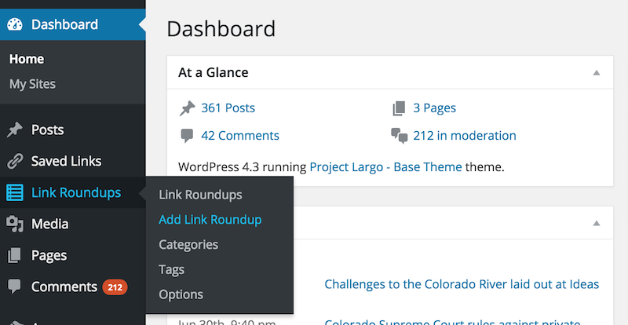

# Argo Links

This plugin makes it easy to collect links from across the web and share them right from your WordPress dashboard.

The plugin has two main features.

1. You can *collect and tag links* via a one-click bookmarklet, and have access to all your links from anywhere. The key difference from sites like Pinterest and Flipboard is that your bookmarks are stored in your WordPress database, so you'll never have to worry about accessing your links from another site.
2. You can *easily share links* via a link roundup post. The link roundup provides you with a quick and easy way of sharing the most interest stories on your beat with your readers. Sharing links in this way is a common pattern amongst bloggers and news aggregators. To learn how to save links and create link roundups, follow the steps below.

## How to save and tag links

Once you've [installed and activated the plugin](installation/), you should see a new menu items titled "Argo Links" from your dashboard's main menu. Hover over the menu and select the "Argo Link This!" link.

On the Argo Link This! page, you'll find a bookmarklet with instructions for adding the bookmarklet to your browser. Add the bookmarklet to your browser, and you're ready to add some links to your site.

Visit a page you'd like to bookmark, and select the "Argo Link This!" bookmarklet. A pop-up will appear with the title and URL of the page pre-filled. If you highlighted a block of text on the page before clicking the "Argo Link This!" bookmarklet, that text will automatically be added to the description field. Optionally add source info and tags to the bookmark, and select the publish button.

Close the bookmarklet and visit the Argo links screen in the admin area of your site. This screen provides you with access to all of your bookmarks. From this page you can filter by date, view links that share the same tag, or search for a specific link. All link details are editable. If, for example, you would like to change the title of the link, hover over the link title and select edit.

## How to create link roundups

Now that you have some links saved to your site, you're ready to create your first link roundup. Go to Link Roundups > Add New from your WordPress dashboard.

The new link roundup page will resemble a regular post in many ways. But there is one important difference. This post type has knowledge of all the links you've bookmarked.

Give your post a title and scroll past the visual editor. Below the editor, look for the "Recent Roundup Links" section of the screen. By default, this section of the page will show you all the links you've bookmarked today, but you can change the filter to show you links from a broader time period.

Select the links that you would like to add to your roundup by selecting the checkbox to the left of the link title. If you would like to add all links from the current screen, select the checkbox to the left of the "title" label. Next, click the "send links to editor" window button. The formatted links and link descriptions will now appear the visual editor.

The Recent Roundup Links section will show a maximum of 15 links at a time. Use the pagination to view additional links. You will need to click the "send links to editor window" button for each view. Say for example you have a link on the second page of results and three links on the first page of results that comprise your roundup. You will need to click the "send links to editor window" twice. Once for the first page of results and once for the second page of results.

Once you have the links that make up your roundup in the editor window, you can edit the links, change the description and make any adjustments that you'd make to a normal post. If you'd like to add a description to the post, go to the first line of the roundup and add a new line. You'll likely notice that the roundup icon that appears to the left of new roundup links appears on the blank line. To remove this icon, select "Heading 4" from the formatting menu.

When you're satisfied with the description and links that you've added to your roundup, publish your post and congratulate yourself on some excellent curatorial work.
